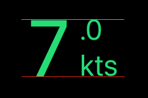
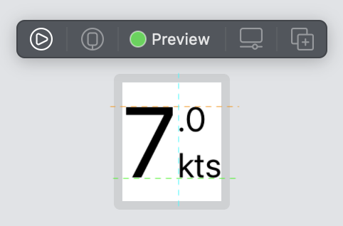

# Aligning SwiftUI text to the baseline and top of another text

I'm trying to achieve a SwiftUI text alignment as illustrated by this image. The goal is to align the top of text ".0" with the top edge of "7" (purple line) and the bottom edge of "kts" with the bottom edge of "7" (red line).

Here is my current SwiftUI code:



```swift
HStack(alignment: .lastTextBaseline, spacing: 3) {

    Text("7")
    .font(.system(size: 70))
    .foregroundColor(Color.green)
    .multilineTextAlignment(.center)
    .minimumScaleFactor(0.3)

    VStack(alignment: .leading, spacing: 5) {

        Text(".7")
        .font(.system(size: 24))
        .foregroundColor(Color.green)

        Text("kts")
        .font(.system(size: 18))
        .foregroundColor(Color.white)

    }

}
```

This code works for the alignment shown by the red line.

What approach would you recommend to also align the top of "7" and ".0" as shown by the purple line?

# Answer

You can use Stacks to stack font. There is no issue for the bottom line, but You can get help from the UIFont that gives you the information you need like:

```swift
struct ContentView: View {
    let bigFont = UIFont.systemFont(ofSize: 70)
    let smallFont = UIFont.systemFont(ofSize: 24)

    var body: some View {
        ZStack(alignment: Alignment(horizontal: .leading, vertical: .center)) {
            HStack(alignment: .firstTextBaseline, spacing: 0) {
                Text("7").font(Font(bigFont))
                Text("kts").font(Font(smallFont))
            }
            HStack(alignment: .firstTextBaseline, spacing: 0) {
                Text("7")
                    .font(Font(bigFont))
                    .opacity(0)
                Text(".0")
                    .font(Font(smallFont))
                    .baselineOffset((bigFont.capHeight - smallFont.capHeight))
            }
        }
    }
}
```


